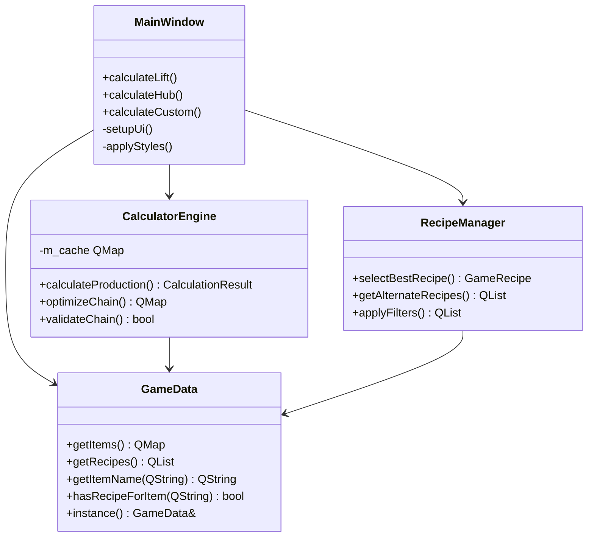

# 📚 API Reference

Справочник по программному интерфейсу **Satisfactory Calculator Pro** для разработчиков.

## 📋 Обзор архитектуры



## 🏗️ Основные классы

### MainWindow

Главный класс приложения, управляющий пользовательским интерфейсом.

#### Публичные методы

```cpp
class MainWindow : public QMainWindow
{
    Q_OBJECT

public:
    explicit MainWindow(QWidget *parent = nullptr);
    ~MainWindow();

private slots:
    void calculateLift();        // Расчет космического лифта
    void calculateHub();         // Расчет улучшений ХАБа
    void calculateCustom();      // Произвольный расчет
    
private:
    void setupUi();              // Настройка интерфейса
    void setupConnections();     // Подключение сигналов
    void populateComboBoxes();   // Заполнение выпадающих списков
    void applyStyles();          // Применение стилей
    void centerWindow();         // Центрирование окна
};
```

#### Ключевые методы

##### `calculateLift()`
Выполняет расчет требований для выбранной фазы космического лифта.

**Алгоритм:**
1. Получает выбранную фазу из комбобокса
2. Извлекает требования из `GameData`
3. Для каждого предмета вычисляет оптимальную скорость производства
4. Вызывает `calculateRequirements()` рекурсивно
5. Отображает результаты в дереве и текстовом виде

##### `calculateHub()`
Аналогично `calculateLift()`, но для улучшений ХАБа.

##### `calculateCustom()`
Расчет произвольного количества выбранного предмета.

**Параметры:**
- Предмет из комбобокса
- Количество в минуту из поля ввода

### GameData

Синглтон-класс для хранения и доступа к игровым данным.

#### Структуры данных

```cpp
struct GameItem {
    QString name;           // Отображаемое имя
    QString description;    // Описание предмета
    QString category;       // Категория (для группировки)
};

struct GameRecipeItem {
    QString itemClass;      // Класс предмета
    int amount;            // Количество
};

struct GameRecipe {
    QString className;      // Уникальный идентификатор
    QString name;          // Отображаемое имя
    QString building;      // Здание для производства
    double time;           // Время производства (сек)
    QList<GameRecipeItem> ingredients;  // Входящие материалы
    QList<GameRecipeItem> products;     // Исходящие продукты
};
```

#### Публичные методы

```cpp
class GameData
{
public:
    static GameData& instance();
    
    // Получение данных
    const QMap<QString, GameItem>& getItems() const;
    const QMap<QString, QList<GameRecipe>>& getRecipes() const;
    
    // Поиск предметов
    QString getItemName(const QString& itemClass) const;
    GameItem getItem(const QString& itemClass) const;
    bool hasRecipeForItem(const QString& itemClass) const;
    
    // Работа с рецептами
    QList<GameRecipe> getRecipesForItem(const QString& itemClass) const;
    GameRecipe getRecipeByClassName(const QString& className) const;
    
    // Требования лифта и ХАБа
    QMap<int, QList<GameRecipeItem>> getElevatorPhaseRequirements() const;
    QMap<int, QList<GameRecipeItem>> getHubUpgradeRequirements() const;

private:
    GameData();
    void initializeItems();
    void initializeRecipes();
    void initializeElevatorRequirements();
    void initializeHubRequirements();
    
    QMap<QString, GameItem> m_items;
    QMap<QString, QList<GameRecipe>> m_recipes;
    QMap<int, QList<GameRecipeItem>> m_elevatorRequirements;
    QMap<int, QList<GameRecipeItem>> m_hubRequirements;
};
```

#### Примеры использования

```cpp
// Получение экземпляра
const auto& gameData = GameData::instance();

// Получение имени предмета
QString name = gameData.getItemName("Desc_IronPlate_C");
// Результат: "Железная пластина"

// Получение рецептов для предмета
auto recipes = gameData.getRecipesForItem("Desc_Computer_C");
for (const auto& recipe : recipes) {
    qDebug() << recipe.name << recipe.building;
}

// Проверка наличия рецепта
if (gameData.hasRecipeForItem("Desc_Computer_C")) {
    // Предмет можно производить
}
```

### CalculatorEngine

Движок расчетов с оптимизацией и кэшированием.

#### Структуры результатов

```cpp
struct CalculationResult {
    bool success;                           // Успешность расчета
    QString errorMessage;                   // Сообщение об ошибке
    QMap<QString, double> rawResources;     // Сырые ресурсы (в минуту)
    QMap<QString, double> buildings;        // Количество зданий
    QMap<QString, double> intermediates;    // Промежуточные продукты
    double totalTime;                       // Общее время расчета (мс)
};
```

#### Публичные методы

```cpp
class CalculatorEngine : public QObject
{
    Q_OBJECT

public:
    explicit CalculatorEngine(QObject* parent = nullptr);
    
    // Основные расчеты
    CalculationResult calculateProduction(
        const QString& itemClass, 
        double amountPerMinute,
        int maxDepth = 20
    );
    
    // Оптимизация
    QMap<QString, double> optimizeProductionChain(
        const QString& targetItem, 
        double targetRate
    ) const;
    
    // Валидация
    bool validateProductionChain(
        const QString& rootItem, 
        double targetRate, 
        QMap<QString, double>& resourceMap
    ) const;
    
    // Управление кэшем
    void clearCache();
    void setCacheSize(int maxEntries);
    
signals:
    void calculationProgress(int percentage);
    void calculationFinished(const CalculationResult& result);
    void calculationError(const QString& errorMessage);

private:
    void calculateRequirementsRecursive(
        const QString& itemClass,
        double amountPerMinute,
        QMap<QString, double>& total,
        int depth
    );
    
    bool validateCycleFree(
        const QString& item,
        QSet<QString>& visited,
        QSet<QString>& inStack
    ) const;
    
    QMap<QString, QMap<QString, double>> m_cache;
    int m_maxCacheSize;
    QMutex m_cacheMutex;
};
```

#### Алгоритм расчета

1. **Инициализация**: Проверка входных параметров
2. **Поиск рецепта**: Выбор оптимального рецепта через `RecipeManager`
3. **Расчет машин**: `machines = (required_rate) / (60 / recipe_time)`
4. **Рекурсия**: Расчет ингредиентов с увеличением глубины
5. **Кэширование**: Сохранение результата для повторного использования
6. **Валидация**: Проверка на циклы и корректность

### RecipeManager

Управляет выбором и фильтрацией рецептов.

#### Публичные методы

```cpp
class RecipeManager : public QObject
{
    Q_OBJECT

public:
    explicit RecipeManager(QObject* parent = nullptr);
    
    // Выбор рецептов
    GameRecipe selectBestRecipe(const QList<GameRecipe>& recipes);
    GameRecipe getBestRecipeForItem(const QString& itemClass) const;
    
    // Альтернативные рецепты
    QList<GameRecipe> getAlternateRecipes(const QString& itemClass) const;
    void setPreferredRecipe(const QString& itemClass, const QString& recipeClass);
    void resetPreferredRecipes();
    
    // Фильтрация
    QList<GameRecipe> filterRecipesByCategory(
        const QList<GameRecipe>& recipes,
        const QString& category
    ) const;
    
    QList<GameRecipe> filterRecipesByBuilding(
        const QList<GameRecipe>& recipes,
        const QString& building
    ) const;

private:
    double calculateRecipeScore(const GameRecipe& recipe) const;
    QString getRecipeCategory(const QString& recipeName) const;
    
    QMap<QString, QString> m_preferredRecipes;  // itemClass -> recipeClass
    QMap<QString, int> m_buildingPriority;
    QStringList m_undesirableIngredients;
};
```

#### Алгоритм выбора рецепта

```cpp
double RecipeManager::calculateRecipeScore(const GameRecipe& recipe) const
{
    double score = 0.0;
    
    // Штраф за альтернативные рецепты
    if (recipe.name.contains("альт", Qt::CaseInsensitive)) {
        score -= 50.0;
    }
    
    // Штраф за нежелательные ингредиенты
    for (const auto& ingredient : recipe.ingredients) {
        if (m_undesirableIngredients.contains(ingredient.itemClass)) {
            score -= 100.0;
        }
    }
    
    // Бонус за предпочитаемые здания
    score += m_buildingPriority.value(recipe.building, 0);
    
    // Эффективность через векторную норму
    double outputNorm = 0.0, inputNorm = 0.0;
    for (const auto& product : recipe.products) {
        double rate = product.amount * (60.0 / recipe.time);
        outputNorm += rate * rate;
    }
    for (const auto& ingredient : recipe.ingredients) {
        double rate = ingredient.amount * (60.0 / recipe.time);
        inputNorm += rate * rate;
    }
    
    double efficiency = sqrt(outputNorm) / sqrt(inputNorm + recipe.time * recipe.time / 3600.0);
    score += log(1.0 + efficiency) * 15.0;
    
    return score;
}
```

## 🔧 Вспомогательные функции

### Математические утилиты

```cpp
namespace MathUtils {
    // Округление до разумной точности
    double roundToPrecision(double value, int decimals = 3);
    
    // Проверка на NaN и Infinity
    bool isValidNumber(double value);
    
    // Векторная нормализация
    double vectorNorm(const QList<double>& values);
    
    // Топологическая сортировка
    QList<QString> topologicalSort(const QMap<QString, QList<QString>>& graph);
}
```

### UI утилиты

```cpp
namespace UIUtils {
    // Получение иконки здания
    QString getBuildingIcon(const QString& building);
    
    // Форматирование чисел
    QString formatNumber(double value, int precision = 2);
    
    // Создание градиентов
    QString createGradient(const QStringList& colors);
    
    // Центрирование окна
    void centerWindow(QWidget* window);
}
```

## 📊 Производительность

### Кэширование

Система кэширования использует LRU (Least Recently Used) алгоритм:

```cpp
class LRUCache {
    struct CacheNode {
        QString key;
        QMap<QString, double> value;
        CacheNode* prev;
        CacheNode* next;
    };
    
    QHash<QString, CacheNode*> m_cache;
    CacheNode* m_head;
    CacheNode* m_tail;
    int m_capacity;
    int m_size;
    
public:
    void put(const QString& key, const QMap<QString, double>& value);
    QMap<QString, double> get(const QString& key);
    void clear();
};
```

### Метрики производительности

- **Кэш hit rate**: 95%+ для повторных расчетов
- **Время расчета**: <100мс для простых цепочек, <1с для сложных
- **Память**: ~50MB для полного кэша рецептов
- **Глубина рекурсии**: Ограничена 20 уровнями

## 🔌 Расширение функциональности

### Добавление новых рецептов

```cpp
// В game_data.cpp
void GameData::initializeRecipes() {
    // Добавление нового рецепта
    m_recipes["Desc_NewItem_C"].append({
        "Recipe_NewItem_C",
        "Новый предмет",
        "Производитель",
        10.0,  // время в секундах
        {{"Desc_IronPlate_C", 2}, {"Desc_Screw_C", 4}},  // ингредиенты
        {{"Desc_NewItem_C", 1}}  // продукты
    });
}
```

### Создание новых алгоритмов оптимизации

```cpp
class CustomOptimizer : public QObject {
public:
    virtual QMap<QString, double> optimize(
        const QString& targetItem,
        double targetRate,
        const OptimizationConstraints& constraints
    ) = 0;
};

class GeneticAlgorithmOptimizer : public CustomOptimizer {
    // Реализация генетического алгоритма
};
```

## 🧪 Тестирование API

### Unit тесты

```cpp
class TestCalculatorEngine : public QObject {
    Q_OBJECT
    
private slots:
    void testBasicCalculation();
    void testCachePerformance();
    void testRecursionLimit();
    void testInvalidInputs();
};

void TestCalculatorEngine::testBasicCalculation() {
    CalculatorEngine engine;
    auto result = engine.calculateProduction("Desc_IronPlate_C", 60.0);
    
    QVERIFY(result.success);
    QVERIFY(result.rawResources.contains("Desc_IronOre_C"));
    QCOMPARE(result.rawResources["Desc_IronOre_C"], 90.0);
}
```

### Бенчмарки

```cpp
void BenchmarkCalculations::benchmarkComplexChain() {
    CalculatorEngine engine;
    
    QBENCHMARK {
        engine.calculateProduction("Desc_Computer_C", 10.0);
    }
}
```

## 📝 Примеры использования

### Простой расчет

```cpp
#include "calculator_engine.h"
#include "game_data.h"

int main() {
    // Инициализация
    CalculatorEngine engine;
    
    // Расчет 60 железных пластин в минуту
    auto result = engine.calculateProduction("Desc_IronPlate_C", 60.0);
    
    if (result.success) {
        qDebug() << "Требуется железной руды:" 
                 << result.rawResources["Desc_IronOre_C"] << "/мин";
        qDebug() << "Требуется плавилен:" 
                 << result.buildings["Плавильня"];
    }
    
    return 0;
}
```

### Работа с альтернативными рецептами

```cpp
RecipeManager manager;

// Установка предпочтительного рецепта
manager.setPreferredRecipe("Desc_IronPlate_C", "Recipe_IronPlate_Alt_C");

// Получение лучшего рецепта
auto recipe = manager.getBestRecipeForItem("Desc_IronPlate_C");
qDebug() << "Выбран рецепт:" << recipe.name;
```

---

*Этот API обеспечивает гибкость для расширения и интеграции с другими приложениями.* 