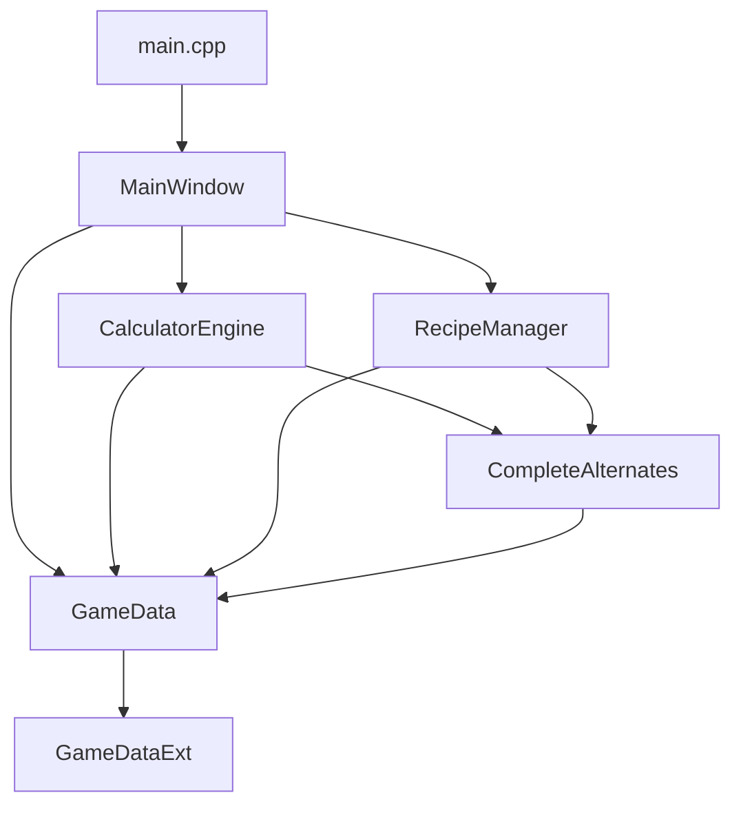

# 🏗️ Структура проекта

Этот документ описывает организацию файлов и папок в проекте **Satisfactory Calculator Pro**.

## 📁 Обзор структуры

```
satisfactory-calculator-pro/
├── 📄 README.md                 # Основная документация проекта
├── 📄 LICENSE                   # MIT лицензия
├── 📄 CHANGELOG.md              # История изменений
├── 📄 CONTRIBUTING.md           # Руководство для разработчиков
├── 📄 DESIGN_GUIDE.md           # Руководство по дизайну
├── 📄 CMakeLists.txt            # Конфигурация сборки CMake
├── 📄 satiscalculator.pro       # Конфигурация сборки qmake
├── 📄 mainwindow.ui             # UI форма главного окна
├── 📄 .gitignore                # Игнорируемые Git файлы
│
├── 📂 src/                      # Исходный код
│   ├── 📄 main.cpp              # Точка входа приложения
│   ├── 📄 mainwindow.cpp        # Главное окно и UI логика
│   ├── 📄 game_data.cpp         # Данные игры (предметы, рецепты)
│   ├── 📄 game_data_ext.cpp     # Расширенные игровые данные
│   ├── 📄 complete_alternates.cpp # Альтернативные рецепты
│   ├── 📄 calculator_engine.cpp # Движок расчетов
│   └── 📄 recipe_manager.cpp    # Управление рецептами
│
├── 📂 include/                  # Заголовочные файлы
│   ├── 📄 mainwindow.h          # Заголовок главного окна
│   ├── 📄 game_data.h           # Заголовок игровых данных
│   ├── 📄 game_data_ext.h       # Расширенные данные
│   ├── 📄 complete_alternates.h # Альтернативные рецепты
│   ├── 📄 calculator_engine.h   # Движок расчетов
│   └── 📄 recipe_manager.h      # Управление рецептами
│
├── 📂 assets/                   # Ресурсы приложения
│   ├── 📂 icons/                # Иконки зданий и предметов
│   └── 📂 recipes/              # Данные рецептов (если есть)
│
├── 📂 docs/                     # Дополнительная документация
│   ├── 📄 PROJECT_STRUCTURE.md  # Этот файл
│   ├── 📄 API_REFERENCE.md      # Справочник API
│   └── 📄 DEPLOYMENT.md         # Инструкции по развертыванию
│
├── 📂 tools/                    # Инструменты сборки и скрипты
│   ├── 📄 build.bat             # Скрипт сборки Windows
│   ├── 📄 build_release.bat     # Релизная сборка
│   └── 📂 scripts/              # Дополнительные скрипты
│
├── 📂 build/                    # Артефакты сборки qmake
├── 📂 build-cmake/              # Артефакты сборки CMake
│
└── 📂 .github/                  # GitHub конфигурация
    └── 📂 workflows/            # CI/CD пайплайны
```

## 📋 Описание папок

### 🔧 `src/` - Исходный код
Содержит все файлы исходного кода C++:

- **`main.cpp`** - Точка входа, создание QApplication и главного окна
- **`mainwindow.cpp`** - Основная логика UI, обработка событий, стили
- **`game_data.cpp`** - Базовые данные игры (предметы, здания, рецепты)
- **`game_data_ext.cpp`** - Расширенные данные (квантовые технологии, Update 9)
- **`complete_alternates.cpp`** - Полный набор альтернативных рецептов
- **`calculator_engine.cpp`** - Движок расчетов с оптимизацией
- **`recipe_manager.cpp`** - Управление выбором рецептов

### 📝 `include/` - Заголовочные файлы
Содержит все заголовочные файлы (.h) с объявлениями классов и функций.

### 🎨 `assets/` - Ресурсы
- **`icons/`** - Иконки для зданий и предметов
- **`recipes/`** - Дополнительные данные рецептов (если требуется)

### 📚 `docs/` - Документация
Расширенная документация проекта:
- Техническая документация
- API справочники  
- Руководства по развертыванию

### 🛠️ `tools/` - Инструменты
Скрипты для автоматизации сборки и развертывания.

## 🔗 Зависимости между модулями



## 📄 Ключевые файлы

### Конфигурация сборки
- **`CMakeLists.txt`** - Современная система сборки (рекомендуется)
- **`satiscalculator.pro`** - Традиционная система сборки Qt

### UI и ресурсы
- **`mainwindow.ui`** - Визуальный дизайн интерфейса (Qt Designer)
- **Встроенные стили** - CSS-подобные стили прямо в коде

### Данные игры
- **Встроенные данные** - Все рецепты и предметы хранятся в коде
- **Отсутствие внешних файлов** - Данные компилируются в приложение

## 🚀 Система сборки

### CMake (рекомендуется)
```bash
mkdir build-cmake && cd build-cmake
cmake ..
cmake --build . --config Release
```

### qmake (альтернатива)
```bash
qmake satiscalculator.pro
make release
```

## 📦 Развертывание

### Windows
- Исполняемый файл: `SatisCalculator.exe`
- Зависимости Qt развертываются автоматически через `windeployqt`

### Портативная версия
- Все зависимости включены в папку с приложением
- Не требует установки Qt на целевой системе

## 🔄 Жизненный цикл разработки

1. **Разработка** в `src/` и `include/`
2. **Тестирование** через сборку
3. **Документирование** в `docs/`
4. **Релиз** через `tools/` скрипты

## 📈 Метрики проекта

- **Исходный код**: ~150KB (7 файлов .cpp)
- **Заголовки**: ~15KB (7 файлов .h)
- **Документация**: ~30KB (5 файлов .md)
- **Общий размер**: ~200KB исходного кода

## 🎯 Принципы организации

1. **Разделение ответственности** - каждый модуль имеет четкую роль
2. **Минимальные зависимости** - модули слабо связаны
3. **Читаемость** - понятная структура папок
4. **Масштабируемость** - легко добавлять новые модули
5. **Переносимость** - стандартная структура C++/Qt проекта

---

*Эта структура обеспечивает качественную организацию кода для профессиональной разработки.* 